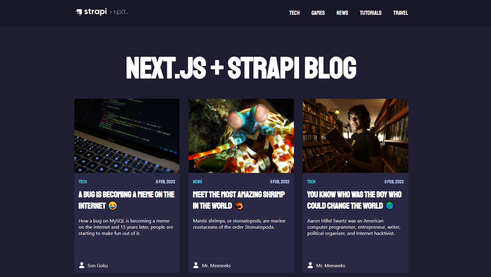

# Next.js Blog with Strapi Headless CMS

## Table of contents

- [About](#about)
- [Preview](#preview)
- [Technologies](#technologies)
- [Dependencies](#dependencies)
- [Installation](#installation)
  - [Cloning](#cloning)
  - [Install Dependencies](#install-dependencies)
  - [Running The Project](#running-the-project)
  - [Build The Project](#build-the-project)

## About

\


\
This project is the **frontend** application (`next.js` hosted on Vercel) of a Headless blog using `Strapi` as CMS (hosted on Heroku) and with image management on Cloudinary.

## Preview

[Click here](https://strapi-blog-frontend-next.vercel.app) to view the frontend project demo.\
[Click here](https://github.com/nicklima/strapi-blog-cms) To see the backend project repository.

## Technologies

- [Node](https://nodejs.org/en/download/)
- [React](https://pt-br.reactjs.org/)
- [Next.js](https://nextjs.org)
- [Styled-components](https://styled-components.com/)
- [TypeScript](https://www.typescriptlang.org)

## Installation

### Cloning

Clone the repository:

```
git clone git@github.com:nicklima/strapi-blog-frontend-next.git
```

### Install Dependencies

Navigate to the project directory

```
cd strapi-blog-frontend-next
```

and install the dependencies:

```
yarn
# or
npm install
```

### Running The Project

After install the dependencies, you can run the app in the development mode.\
Open [http://localhost:3000](http://localhost:3000) to view it in the browser.

Remember that you will need to set the URL of your Strapi project in your environment variables.

If you want, you can download our [Strapi CMS](https://github.com/nicklima/strapi-blog-cms) repository, install its dependencies and run the yarn develop command and use the url of localhost in your `.env` file

```
NEXT_PUBLIC_STRAPI_API_URL=http://localhost:1337
```

After downloading the CMS Strapi code and installing the dependencies, run the `yarn develop` command to run the local environment.\
Remember to keep the CMS environment **running in another terminal tab** and then run the command to run the local environment of the frontend of our application.

```
yarn dev
# or
npm run dev
```

### Build The Project

After install the dependencies, you can build the app for production to the `.next` folder.\

```
npm run build
# or
yarn build
```

Your app is ready to be deployed!

## About Next

Visit <a aria-label="next.js learn" href="https://nextjs.org/learn">https://nextjs.org/learn</a> to get started with Next.js or Visit [https://nextjs.org/docs](https://nextjs.org/docs) to view the full documentation.
