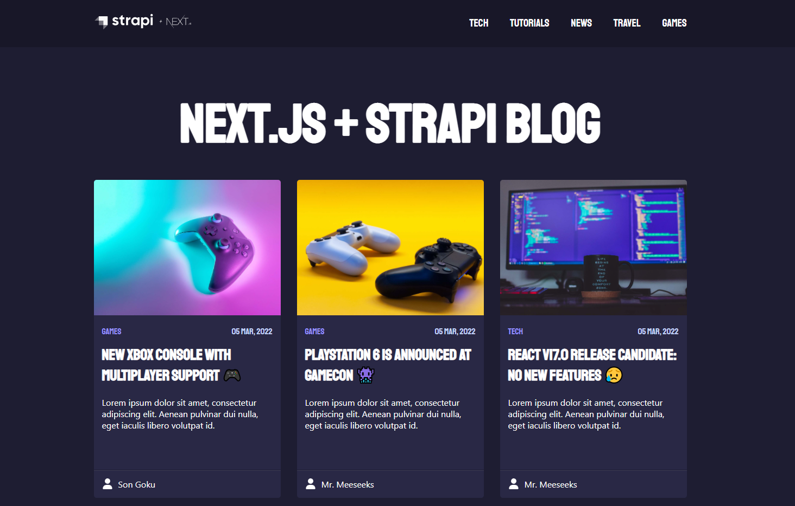

# Next.js Blog with Strapi Headless CMS

\


\
This project is the **frontend** application (`next.js` hosted on Vercel) of a Headless blog using `Strapi` as CMS (hosted on Heroku), including image management.

This starter is based on [Next.js Blog Starter](https://github.com/strapi/strapi-starter-next-blog) and was create to be an option of starter with Styled Components + TypeScript.

## Table of contents

- [Preview](#preview)
- [Credits](#credits)
- [Technologies](#technologies)
- [Dependencies](#dependencies)
- [Installation](#installation)
  - [Cloning](#cloning)
  - [Install Dependencies](#install-dependencies)
  - [Running The Project](#running-the-project)
  - [Build The Project](#build-the-project)
- [About Next.js](#about-next)
- [About Strapi](#about-strapi)
- [License](#license)

## Preview

[Click here](https://strapi-blog-frontend-next.vercel.app) to view the frontend project demo.\
[Click here](https://github.com/nicklima/strapi-blog-cms) To see the backend project repository.

## Credits

The photos are from [Unsplash](https://unsplash.com) and [Strapi](https://strapi.io).

- Son Goku by [Jeet Dhanoa](https://unsplash.com/@jeetdhanoa?utm_source=unsplash&utm_medium=referral&utm_content=creditCopyText)

- Cappuccino by [Nathan Dumlao](https://unsplash.com/@nate_dumlao?utm_source=unsplash&utm_medium=referral&utm_content=creditCopyText)

- Xbox joystick by [Javier Martínez](https://unsplash.com/@cjdante?utm_source=unsplash&utm_medium=referral&utm_content=creditCopyText)

- Playstation controlers by [Igor Karimov](https://unsplash.com/@ingvar_erik?utm_source=unsplash&utm_medium=referral&utm_content=creditCopyText)

- Flat screen monitor and black ceramic mug by [Tudor Baciu](https://unsplash.com/@baciutudor?utm_source=unsplash&utm_medium=referral&utm_content=creditCopyText)

- Sunset by [Dave Hoefler](https://unsplash.com/@davehoefler?utm_source=unsplash&utm_medium=referral&utm_content=creditCopyText)

- Boats in Lake by [Luca Bravo](https://unsplash.com/@lucabravo?utm_source=unsplash&utm_medium=referral&utm_content=creditCopyText)

- Amazon Echo and lamp by [Leon Dewiwje](https://unsplash.com/@elodiso?utm_source=unsplash&utm_medium=referral&utm_content=creditCopyText)

- Mr. Meeseeks by [Jakub Dziubak](https://unsplash.com/@jckbck?utm_source=unsplash&utm_medium=referral&utm_content=creditCopyText)

- Legend of Zelda action figures by [Ryan Quintal](https://unsplash.com/@ryanquintal?utm_source=unsplash&utm_medium=referral&utm_content=creditCopyText)

- Vue.js code by [Emil Priver](https://unsplash.com/@emilpriver?utm_source=unsplash&utm_medium=referral&utm_content=creditCopyText)

- Bird at snow by [Dennis Buchner](https://unsplash.com/@baitman?utm_source=unsplash&utm_medium=referral&utm_content=creditCopyText)

- Git branch by [Yancy Min](https://unsplash.com/@yancymin?utm_source=unsplash&utm_medium=referral&utm_content=creditCopyText)

- Strapi image by [Strapi Blog](https://strapi.io/blog/announcing-strapi-v4)

## Technologies

- [Node](https://nodejs.org/en/download/)
- [React](https://pt-br.reactjs.org/)
- [Next.js](https://nextjs.org)
- [Styled-components](https://styled-components.com/)
- [TypeScript](https://www.typescriptlang.org)

## Installation

### Cloning

Clone the repository:

```
git clone git@github.com:nicklima/strapi-blog-frontend-next.git
```

### Install Dependencies

Navigate to the project directory

```
cd strapi-blog-frontend-next
```

and install the dependencies:

```
yarn
# or
npm install
```

### Running The Project

After install the dependencies, you can run the app in the development mode.\
Open [http://localhost:3000](http://localhost:3000) to view it in the browser.

Remember that you will need to set the URL of your Strapi project in your environment variables.

If you want, you can download our [Strapi CMS](https://github.com/nicklima/strapi-blog-cms) repository, install its dependencies and run the yarn develop command and use the url of localhost in your `.env` file

```
NEXT_PUBLIC_STRAPI_API_URL=http://localhost:1337
```

After downloading the CMS Strapi code and installing the dependencies, run the `yarn develop` command to run the local environment.\
Remember to keep the CMS environment **running in another terminal tab** and then run the command to run the local environment of the frontend of our application.

```
yarn dev
# or
npm run dev
```

### Build The Project

After install the dependencies, you can build the app for production to the `.next` folder.\

```
npm run build
# or
yarn build
```

Your app is ready to be deployed!

## About Next

Visit <a aria-label="next.js learn" href="https://nextjs.org/learn">https://nextjs.org/learn</a> to get started with Next.js or visit [https://nextjs.org/docs](https://nextjs.org/docs) to view the full documentation.

## About Strapi

Check the [Strapi quick start](https://docs.strapi.io/developer-docs/latest/getting-started/quick-start.html) to get started with Strapi or visit [Strapi Docs](https://docs.strapi.io/developer-docs/latest/getting-started/introduction.html) to view the full documentation.

## License

MIT © [Nick Lima](https://github.com/nicklima)
